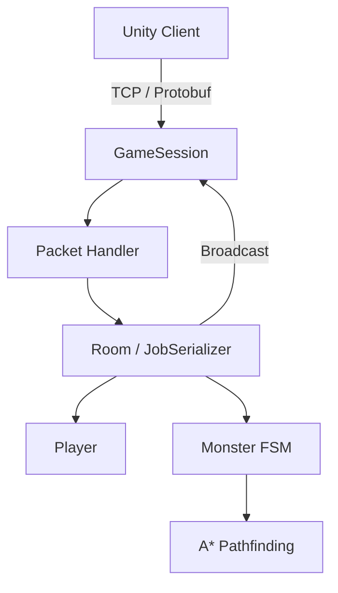
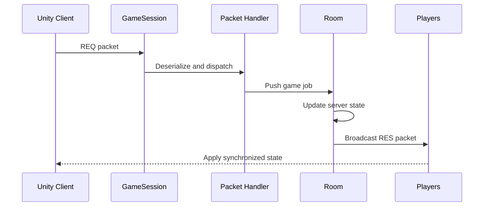

# Last-Stand Main Server

> Unity 클라이언트와 연동되는 C++ 기반 멀티플레이 게임 서버

Last-Stand는 다수의 플레이어가 몬스터를 처치하며 생존하는 멀티플레이 액션 게임입니다.

이 저장소는 Last-Stand의 **메인 게임 서버**를 담당하며, 플레이어와 몬스터의 상태 관리, 이동 및 전투 처리, 패킷 통신, Room 단위 게임 로직을 처리합니다.

C++ 비동기 네트워크 라이브러리를 기반으로 서버를 구성하고, `JobSerializer`를 통해 동일한 게임 공간에서 발생하는 작업의 실행 순서를 보장하도록 설계했습니다.

---

## 주요 기능

### 비동기 네트워크 통신

* IOCP 기반 비동기 소켓 통신
* `Overlapped I/O`를 활용한 비동기 `Accept`, `Connect`, `Send`, `Recv`
* 세션별 송수신 버퍼 및 전송 대기열 관리
* 다수의 클라이언트 연결을 처리하는 멀티스레드 구조
* Windows IOCP와 Linux/macOS 이벤트 처리 구조를 고려한 네트워크 코어 설계

### Room 단위 게임 로직

* 플레이어와 몬스터를 Room 단위로 관리
* 입장, 퇴장, 이동, 공격, 사망 및 부활 처리
* Room에 소속된 플레이어를 대상으로 패킷 브로드캐스트
* 동일 Room에서 발생하는 작업을 순차적으로 처리하여 데이터 경합 방지

### 플레이어 상태 동기화

* 플레이어 위치 및 이동 방향 동기화
* 공격 및 피격 결과 전달
* 체력, 사망 상태 및 부활 위치 동기화
* 접속 및 퇴장 시 다른 플레이어에게 객체 상태 전달

### 몬스터 AI

* 서버 권한 기반 몬스터 상태 관리
* `Idle`, `Chase`, `Attack`, `Dead` 상태로 구성된 FSM
* 플레이어 탐색 및 추적
* 공격 거리 판정 및 피해 처리
* 사망 이후 재생성 처리

### 길 찾기

* A* 알고리즘을 이용한 몬스터 이동 경로 탐색
* 이동 가능한 타일 데이터를 기반으로 경로 계산
* 일정 시간 또는 조건에 따라 추적 경로 갱신
* 이동 가능한 위치에서 플레이어와 몬스터 생성

### 패킷 직렬화

* Google Protocol Buffers 기반 패킷 정의
* 요청 패킷과 응답 패킷을 `REQ_`, `RES_` 규칙으로 구분
* 패킷 ID와 핸들러 코드 자동 생성
* Unity 클라이언트와 C++ 서버가 동일한 프로토콜 구조 공유

---

## 서버 구조



### 패킷 처리 흐름



클라이언트에서 전달된 요청은 다음과 같은 순서로 처리됩니다.

1. `GameSession`이 패킷을 수신합니다.
2. 패킷 헤더의 ID를 통해 알맞은 핸들러를 호출합니다.
3. 처리할 작업을 Room의 작업 큐에 등록합니다.
4. Room에서 플레이어 또는 몬스터의 상태를 변경합니다.
5. 변경 결과를 Room에 속한 클라이언트에게 브로드캐스트합니다.

클라이언트가 전달한 값을 그대로 중계하는 것이 아니라, 서버에서 게임 상태를 관리하고 처리 결과를 전달하는 **서버 권한 구조**를 지향했습니다.

---

## 동시성 처리

여러 네트워크 스레드가 하나의 Room 상태에 동시에 접근하면 플레이어 및 몬스터 데이터에 경쟁 상태가 발생할 수 있습니다.

Last-Stand에서는 Room에서 처리해야 하는 작업을 `JobSerializer`에 등록하고 순차적으로 실행합니다.

```text
Network Thread
      │
      ▼
Packet Handler
      │
      ▼
Room Job Queue
      │
      ▼
Serialized Game Logic
```

이를 통해 다음과 같은 게임 로직을 동일한 실행 흐름에서 처리합니다.

* 플레이어 입장 및 퇴장
* 이동 및 위치 갱신
* 공격과 피해 계산
* 사망 및 부활
* 몬스터 AI 갱신
* 객체 생성 및 제거

공유 데이터마다 락을 추가하는 방식보다 게임 로직의 실행 단위를 Room으로 묶어, 코드의 복잡성과 불필요한 락 경합을 줄이고자 했습니다.

---

## 주요 객체

| 객체                    | 역할                             |
| --------------------- | ------------------------------ |
| `Server`              | 게임 서버 초기화 및 실행                 |
| `Listener`            | 클라이언트 연결 요청 수신                 |
| `Session`             | 비동기 송수신과 연결 상태 관리              |
| `GameSession`         | 게임 패킷 수신 및 게임 로직 연결            |
| `Room`                | 플레이어와 몬스터, Room 작업 관리          |
| `Player`              | 플레이어 위치, 체력 및 전투 상태 관리         |
| `Monster`             | 몬스터 상태와 FSM 기반 AI 관리           |
| `GameObject`          | Player와 Monster가 공유하는 객체 정보 관리 |
| `JobSerializer`       | Room 작업의 순차 실행 보장              |
| `ServerPacketHandler` | 패킷 역직렬화 및 핸들러 호출               |
| `PathFinder`          | A* 기반 이동 경로 탐색                 |

---

## 기술 스택

| 구분                 | 기술                                     |
| ------------------ | -------------------------------------- |
| Language           | C++, Python                            |
| Networking         | IOCP, Overlapped I/O, TCP/IP           |
| Concurrency        | Multi-threading, Atomic, JobSerializer |
| Serialization      | Google Protocol Buffers                |
| Pathfinding        | A* Algorithm                           |
| AI                 | Finite State Machine                   |
| Package Management | vcpkg                                  |
| IDE                | Visual Studio 2022                     |
| Client             | Unity, C#                              |

---

## 프로젝트 구조

> 아래 구조는 실제 저장소의 디렉터리 이름에 맞게 수정할 예정입니다.

```text
Last-Stand-MainServer/
├── MainServer/              # 게임 서버 로직
│   ├── GameSession          # 클라이언트 세션
│   ├── Room                 # Room 및 게임 로직
│   ├── Player               # 플레이어 상태 관리
│   ├── Monster              # 몬스터 AI
│   └── Protocol             # 패킷 핸들러 및 생성 코드
│
├── ServerCore/              # 비동기 네트워크 코어
│   ├── Session              # 연결 및 송수신 관리
│   ├── Listener             # 클라이언트 연결 수락
│   ├── SendBuffer           # 전송 버퍼 관리
│   ├── Job                  # 비동기 작업
│   └── JobSerializer        # 작업 순차 처리
│
├── Common/                  # 공용 코드 및 프로토콜
│   ├── Protocol             # Protobuf 정의
│   └── PacketGenerator      # 패킷 코드 생성
│
└── README.md
```

---

## 패킷 예시

플레이어 이동 요청은 클라이언트에서 서버로 전달되고, 서버는 상태를 갱신한 뒤 Room의 플레이어들에게 결과를 전달합니다.

```protobuf
message REQ_MOVE
{
    PositionInfo info = 1;
}

message RES_MOVE
{
    ObjectInfo player = 1;
}
```

```text
Unity Client
    │
    │ REQ_MOVE
    ▼
GameSession
    │
    ▼
Room::HandleMove()
    │
    ├── 플레이어 위치 갱신
    │
    └── RES_MOVE 브로드캐스트
```

---

## 구현 시 중점적으로 고민한 부분

### 게임 로직과 네트워크 로직의 분리

네트워크 스레드에서 게임 상태를 직접 변경하지 않고, 패킷 핸들러가 Room 작업을 등록하도록 구성했습니다. 이를 통해 네트워크 처리와 게임 로직의 책임을 분리했습니다.

### 상태 변경 순서 보장

같은 Room에서 이동, 공격, 사망과 같은 이벤트가 동시에 발생할 수 있습니다. 이러한 작업을 `JobSerializer`에서 순차 처리해 상태 변경 순서를 보장했습니다.

### 서버 중심의 상태 관리

플레이어와 몬스터의 체력, 위치, 사망 여부와 같은 주요 상태를 서버에서 관리합니다. 클라이언트는 요청을 보내고 서버가 전달한 결과를 화면에 반영합니다.

### 서버 기반 몬스터 AI

몬스터의 탐색, 추적, 공격 및 사망 상태를 서버에서 처리합니다. 이를 통해 모든 클라이언트가 동일한 몬스터 상태를 전달받도록 구성했습니다.

---

## 개선 예정 사항

* 더미 클라이언트를 활용한 동시 접속 부하 테스트
* TPS, 평균 처리 시간, CPU 및 메모리 사용량 측정
* 플레이어 위치 검증 및 비정상 이동 방지
* 관심 영역 기반 브로드캐스트 적용
* 길 찾기 연산 최적화
* 서버 로그 및 모니터링 체계 개선
* 패킷 생성 및 빌드 과정 자동화
* 단위 테스트 및 통합 테스트 추가

---

## 관련 저장소

* [Last-Stand Main Server](https://github.com/Back2Play-LastStand/Last-Stand-MainServer)
* [Last-Stand Client](https://github.com/Back2Play-LastStand/Last-Stand-Client)
* [Last-Stand Login Server](https://github.com/Back2Play-LastStand/Last-Stand-Server)

---

## 담당 영역

* C++ 비동기 게임 서버 구현
* IOCP 기반 네트워크 코어 구성
* Session 및 비동기 송수신 구조 구현
* Room 단위 게임 로직 설계
* JobSerializer 기반 동시성 처리
* Protocol Buffers 패킷 구조 설계
* 플레이어 이동, 전투, 사망 및 부활 처리
* FSM 기반 몬스터 AI 구현
* A* 기반 몬스터 길 찾기 구현
* Unity 클라이언트와 게임 상태 동기화

---

## License

이 프로젝트는 포트폴리오 목적으로 제작되었습니다.

소스 코드의 사용 및 배포에 관한 자세한 내용은 저장소 관리자에게 문의해 주세요.
